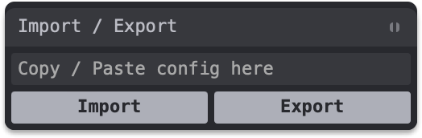

# Tweakpane plugin Import / Export

Plugin that provides a user interface to import / export values within [Tweakpane](https://github.com/cocopon/tweakpane).

<br>

<p align="center">
  
</p>

## Install

```bash
pnpm add tweakpane-plugin-import-export
```

## Usage

```ts
import { Pane } from 'tweakpane'
import * as ImportExportPlugin from 'tweakpane-plugin-import-export'

// Or using a CDN:
// import { Pane } from 'https://esm.sh/tweakpane'
// import * as ImportExportPlugin from 'https://esm.sh/tweakpane-plugin-import-export'

const pane = new Pane()
pane.registerPlugin(ImportExportPlugin)

pane.addBlade({ view: 'import-export' })
```
